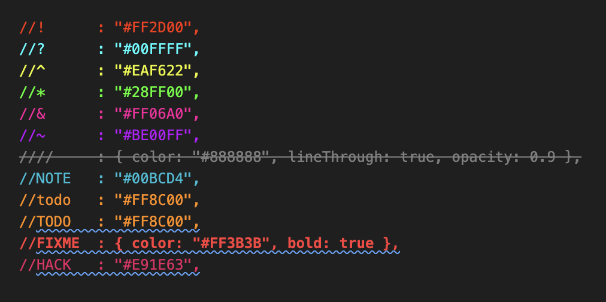

# Custom Color Comment

[](https://marketplace.visualstudio.com/items?itemName=kmmhanan.custom-color-comment)
[](./LICENSE)

**[Install from the VS Code Marketplace →](https://marketplace.visualstudio.com/items?itemName=kmmhanan.custom-color-comment)**

Color comments based on a tag right after the comment marker — inspired by
**Colorful Comments**, rebuilt to be fully customizable from `settings.json`
and to work across virtually any language, not just `//`.



---

## ✨ Features

- 🏷️ **Tag-based coloring** — `//! red`, `//? cyan`, `// TODO: orange`, `//// grayed-out strikethrough`
- 🌍 **Any language** — Python's `#`, Lua's `--`, HTML's `<!-- -->`, block comments `/* */`, and more
- 🎨 **Fully customizable** — color, background, bold, italic, line-through, opacity
- ⚡ **Sensible defaults** out of the box, override or extend anything via `settings.json`

---

## 📦 Installation

Search **"Custom Color Comment"** in the VS Code Extensions view, or install
directly from the [Marketplace](https://marketplace.visualstudio.com/items?itemName=kmmhanan.custom-color-comment).

---

## 🚀 Usage

Write a tag right after your comment marker:

```js
//! Test red color
//? What about this branch?
// TODO: refactor this later
//// this whole block is disabled
```

```python
#! also works here
```

---

## 🎨 Default Tags

| Tag     | Style                                 |
| ------- | ------------------------------------- |
| `!`     | red (`#FF2D00`)                       |
| `?`     | cyan (`#00FFFF`)                      |
| `^`     | yellow (`#EAF622`)                    |
| `*`     | green (`#28FF00`)                     |
| `&`     | pink (`#FF06A0`)                      |
| `~`     | purple (`#BE00FF`)                    |
| `todo`  | mustard (`#FF8C00`), case-insensitive |
| `FIXME` | red, bold                             |
| `NOTE`  | cyan (`#00BCD4`)                      |
| `HACK`  | pink (`#E91E63`)                      |
| `////`  | gray, line-through, 90% opacity       |

> Plain, untagged `//` comments are left at your theme's normal comment
> color by default — nothing greys them out unless you configure it.

---

## ⚙️ Custom Colors — `settings.json`

```json
"ccComment.tags": {
  "!": "#FF0000",
  "?": "#121212",
  "////": { "color": "#999999", "lineThrough": true, "opacity": 0.9 }
  "TODO": { "color": "#FFA500", "bold": true },
  "WARN": { "color": "#FFD700", "backgroundColor": "#332200", "italic": true },
}
```

Each value is either a plain hex string, or an object with any of:

| Property          | Type    | Effect                  |
| ----------------- | ------- | ----------------------- |
| `color`           | string  | text color (hex)        |
| `backgroundColor` | string  | background color (hex)  |
| `bold`            | boolean | bold text               |
| `italic`          | boolean | italic text             |
| `lineThrough`     | boolean | strikethrough           |
| `opacity`         | number  | `0`–`1`, fades the text |

- Your entries merge on top of the defaults (yours win on conflicts). Set
  `"ccComment.disableDefaultTags": true` to use only your own tags.
- Letter tags (like `TODO`) match as a whole word, so `TODOING` won't
  falsely trigger.
- Symbol tags (`!`, `?`, `*`) match right after the comment marker, with or
  without a space: `//!` and `// !` both work.
- Tags that repeat the comment marker itself (like `////`) are matched from
  the true start of the comment, so a 4-slash line is only caught by `////`,
  not accidentally by a 2- or 3-slash rule.

---

## 📜 License

MIT © [Kmm Hanan](https://github.com/kmmhanan) — see [LICENSE](./LICENSE).
